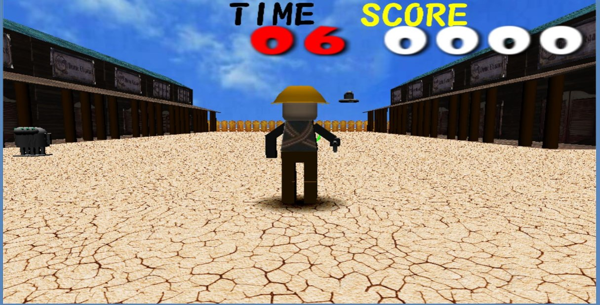

# タイトル(GameTitle)
SHOTBREAK

# 制作期間
3カ月

# 開発環境(Development Tools)
+ Visual Studio 2010 community
+ DirectX9
+ Metasequoia
+ Studio One3

# 開発言語(Programming Language)
+ C

# 操作方法(Operate)
+ 移動(Move):W A S D

+ 弾発射(Shot):Space Key

+ プレイヤー向き(Player Rotation): ↑ ↓ ← →
